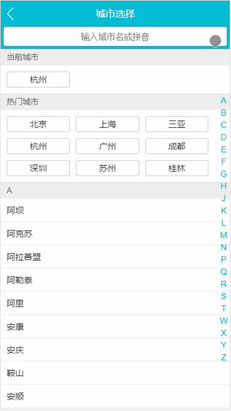

# 仿去哪儿网Vue实现

## 技术栈
* Vue-cli 3.0脚手架工具
* Vue 2.5.17
* stylus
* Vue-Router
* Vuex
* Easy-Mock

## 项目实现效果展示

### 首页


首页仿照目前去哪儿网的页面布局及样式完美还原

### 城市选择页



城市选择页实现了字母表的滚动效果，城市搜索

### 详情页


详情页实现了景点详情渲染、图片画廊公用组件和图片渐入的动画

## 项目安装
```
npm install
```

### 运行DevServer
```
npm run serve
```

### 打包编译
```
npm run build
```

### ESLint检查
```
npm run lint
```
